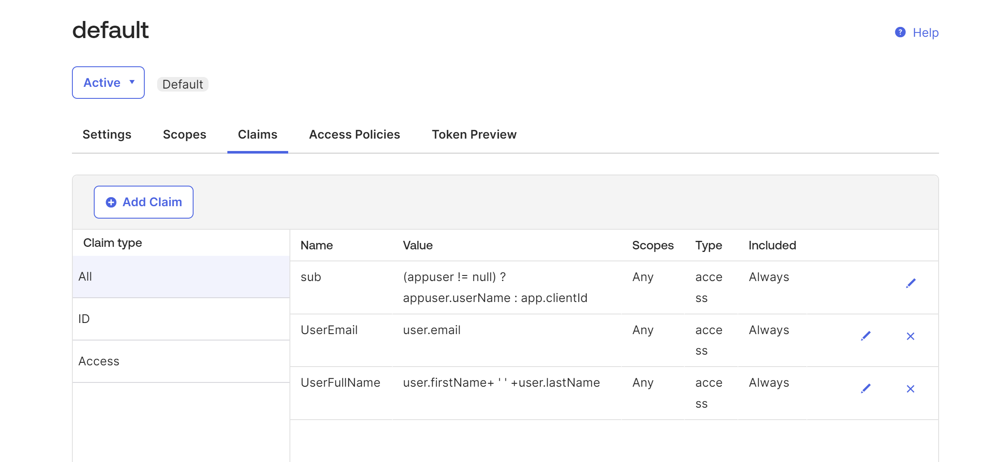

# Budget Management Backend API

This backend API is designed to support the Budget Management Angular application, providing essential CRUD (Create, Read, Update, Delete) operations for budgets, expenses, and income. The API is seamlessly integrated with Okta as resource server for user authentication and Google OAuth for secure user login.

## Table of Contents

- [Features](#features)
- [Prerequisites](#prerequisites)
- [Getting Started](#getting-started)
- [Deployment](#deployment)
- [Demo](#demo)

## Features

- **User Authentication**: Secure user authentication using Okta and Google OAuth.
- **CRUD Operations**: Perform CRUD operations on budgets, and expenses.
- **Data Validation**: Input data validation and error handling.
- **RESTful API**: Follows RESTful principles for API design.

## Prerequisites

Before you begin, ensure you have met the following requirements:

- Java 17 or higher installed.
- [Spring Boot](https://spring.io/projects/spring-boot) installed.
- [Okta](https://developer.okta.com) account for authentication configuration.
- [Google Developer Console](https://console.developers.google.com) project for Google OAuth setup.
- [Angular Budget Management](https://github.com/your/angular-app-repo) application installed and configured to use this API.

## Getting Started

To get started with this API, follow these steps:
1. Clone this repository:  
   git clone https://github.com/The-Hustler-Hattab/BudgetSpringApi.git
2. Setup db tables using schema.sql present in resources folder.
3. Add mysql connection details to application.properties.
4. Add Google Oauth credentials, and OKTA JWK URI to application.properties.
5. Create custom claims on OKTA server:  
   UserEmail: user.email  
   UserFullName: user.firstName+ ' ' +user.lastName
     

## Deployment
This API is deployed to AWS cloud hosting platform Make sure to configure environment-specific properties and security settings before deploying to a production environment.

### Demo
https://budget-spring.mtattab.com/
---
Project developed by Mohammed Hattab (https://github.com/The-Hustler-Hattab)